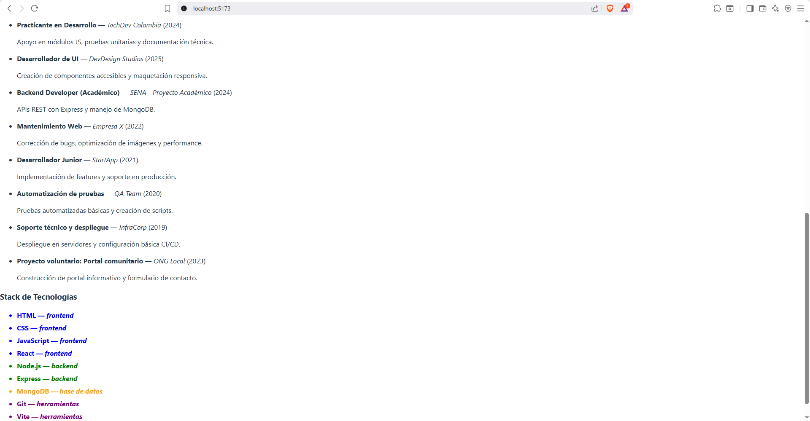

# CV React - Juan Londoño

Proyecto: Hoja de vida dinámica hecha con React + Vite.

## Captura de pantalla


### Sección adicional del proyecto


## Cómo ejecutar
1. Clonar:
```bash
git clone https://github.com/JuanGoez855/cv-react-juan-londono.git

## Instrucciones para ejecutar el proyecto

1. Instalar dependencias:
   ```bash
   npm install
   npm run dev