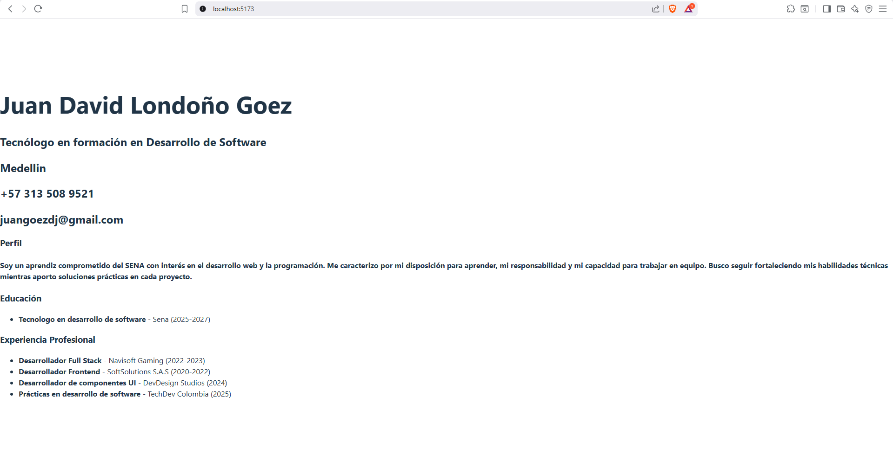

# CV React - Juan Londoño

Proyecto desarrollado con **React + Vite** para crear una hoja de vida digital con componentes como Cabecera, Educación, Experiencia, Habilidades y Footer.

---



---

## Cómo ejecutar el proyecto

### 1. Clonar el repositorio
```bash
git clone https://github.com/JuanGoez855/cv1-react-juan-londono.git